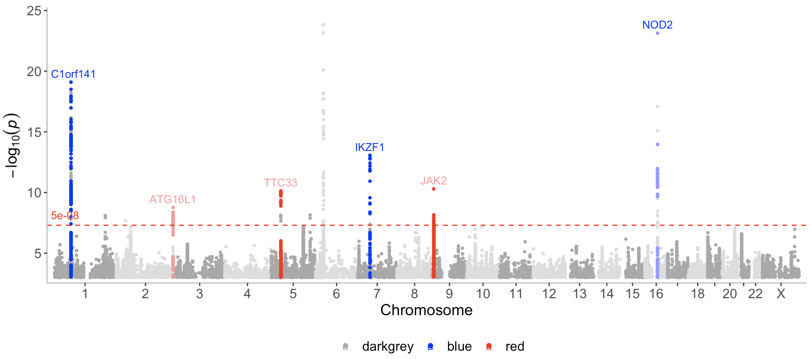
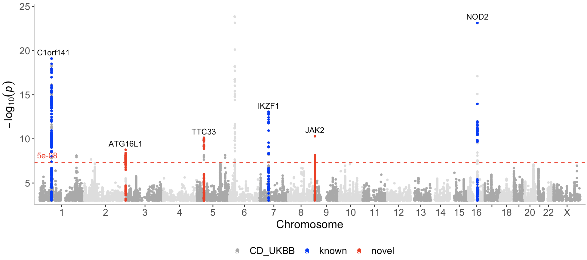

# *topr*: an R package for viewing and annotating genetic association results


## Citation

Please cite the following paper if you use *topr* in a publication:

Juliusdottir, T. *topr*: an R package for viewing and annotating genetic association results. BMC Bioinformatics 24, 268 (2023). https://doi.org/10.1186/s12859-023-05301-4


## Installation
<hr>

Install from CRAN:

``` r
install.packages("topr")
```

Or from github:

``` r
devtools::install_github("totajuliusd/topr")
```

And then load the package:

``` r
library(topr)
```


## Main features and functionality
<hr>

*topr* is written in the R programming language and utilises the ggplot2 and ggrepel R graphics libraries for plotting.

*topr's* two main plotting functions are <code>manhattan()</code> and <code>regionplot()</code>. 

The manhattan() function returns a **ggplot object**. The regionplot() function draws three ggplotGrobs aligned using egg::gtable_frame, however it can be called with the <code>extract_plots</code> argument set to TRUE to return a list of three **ggplot objects** instead.


### Example input datasets 

*See the <a href="https://totajuliusd.github.io/topr/articles/input_datasets.html">Input datasets vignette</a> for more detailed information.*

Input datasets must include least three columns (<code>CHROM, POS</code> and <code>P</code>), where naming of the columns is flexible (i.e the chr label can be either chr or chrom and is case insensitive).

*topr* has 3 inbuilt GWAS results (<code>CD_UKBB, CD_FINNGEN</code> and <code>UC_UKBB</code>). To get information on them, do:

``` r
?CD_UKBB
?CD_FINNGEN
?UC_UKBB
```

The chromosome in the <code>CHROM</code> column can be represented with or without the <i>chr</i> suffix, e.g (chr1 or 1)


### Basic usage 
<hr>

Basic usage of *topr's* key functions is as follows.
<br>

#### Manhattan
<hr>

See the <a href="https:///totajuliusd.github.io/topr/articles/manhattan.html">Manhattan vignette</a> for more detailed examples of how to use the manhattan plot function.

View the whole genome association results on a Manhattan plot:

``` r
manhattan(CD_UKBB)
```

Annotate the lead/index variants (with p-values below 5e-9) with their nearest gene:

``` r
manhattan(CD_UKBB, annotate=5e-9)
```

View multiple GWAS results on the same plot

``` r
manhattan(list(CD_UKBB, CD_FINNGEN), legend_labels = c("UKBB", FinnGen"))
```

<br>

#### Regionplot
<hr>
See the <a href="https:///totajuliusd.github.io/topr/articles/regionplot.html">Regionplot vignette</a> for more detailed examples of how to use the regionplot function.

Further zoom-in on a genetic region by gene name (*IL23R*):

``` r
regionplot(CD_UKBB, gene="IL23R")
```

View the correlation pattern between the variants within the region in a locuszoom like plot.
Note that the variant correlation (<code>R2</code>) has to be pre-calculated and included in the input dataframe.

``` r
locuszoom(R2_CD_UKBB)
```

Display multiple GWAS results zoomed in on the *IL23R* gene

``` r
regionplot(list(UC_UKBB, CD_UKBB), gene="IL23R")
```

<br>

#### Other useful functions
<hr>

Extract lead/index variants from the GWAS dataset (<code>CD_UKBB</code>):

``` r
get_lead_snps(CD_UKBB)
```

Annotate the lead/index variants with their nearest gene:

``` r
get_lead_snps(CD_UKBB) %>% annotate_with_nearest_gene()
```

Get genomic coordinates for a gene (*topr* uses genome build GRCh38.p13 by default):

``` r
get_gene_coords("IL23R")
```
Get genomic coordinates for a gene using genome build GRCh37 instead.

``` r
get_gene_coords("IL23R", build="37")
```

Get snps within a region:

``` r
get_snps_within_region(CD_UKBB, region = "chr1:67138906-67259979")
```

Get the top variant on a chromosome:
``` r
get_top_snp(CD_UKBB, chr="chr1")
```

Create a snpset by extracting the top/lead variants from the CD_UKBB dataset and overlapping variants (by position) in the CD_FINNGEN dataset. 

``` r
get_snpset(CD_UKBB, CD_FINNGEN)
```

Create an effecplot by plotting the effect sizes of top/lead variants overlapping in two datasets.
``` r
effectplot(list(CD_UKBB, CD_FINNGEN), annotate = 1e-08)
```

<br>

#### How to use *topr* with other species than human
<hr>

By default *topr* uses the human genome assembly for annotation. As of from version xxxx. topr can be used with different gene annotations as long as they are provided by the user in a specific format. 

Required columns in the gene annotation file are the following: <code>chrom,gene_start_gene_end,gene_symbol,biotype,exon_chromstart</code> and <code>exon_chromend</code>

To see an example, view the inbuilt human genome annotation file (hg38) from the <code>enshuman</code> package:

``` r
head(n=2, enshuman::hg38)
```

Note that there is no *"chr"* prefix in front of the chromosome name.

##### Example using the mouse genome

Start by downloading and unzipping the **mouse gtf** file. From within the terminal this can be done as follows:

``` r
wget https://ftp.ensembl.org/pub/current/gtf/mus_musculus/Mus_musculus.GRCm39.111.gtf.gz
gunzip Mus_musculus.GRCm39.111.gtf.gz
```

Next convert the file into the format required by topr

``` r
perl mk_annotation_file.pl Mus_musculus.GRCm39.111.gtf > Mus_musculus.GRCm39.111.tsv
```

Then from within your R editor do:
``` r
mus_musculus <- read.delim("Mus_musculus.GRCm39.111.tsv", sep="\t",header=T)
```

Then optionally to save the data in a more compact .rda format:

``` r
save(mus_musculus, file="mus_musculus.rda", compress='xz')
#and then to load from the .rda file, do:
load("mus_musculus.rda")
```

Then to use the mouse build with *topr*, assign <code>mus_musculus</code> to the build argument in *topr's* functions.  

Examples (note that CD_UKBB are human association results, and only used here as a proof of concept): 
``` r
manhattan(CD_UKBB, annotate=1e-14, build=mus_musculus)
regionplot(CD_UKBB, gene="Cps1", build=mus_musculus)
CD_UKBB %>% get_lead_snps() %>% annotate_with_nearest_gene(build=mus_musculus)
get_gene_coords("Cps1", build=mus_musculus)
```


#### How to color specific peaks on the Manhattan plot
<hr>

I use the inbuilt <code>CD_UKBB</code> dataset in this example and create two dataframes containing hypothetically known and novel loci. 

I start by annotating the variants in the <code>CD_UKBB</code> dataset so they can be extracted based on their nearest gene annotation.
``` r
CD_UKBB_annotated <- CD_UKBB %>% annotate_with_nearest_gene()
```

Next I create two dataframes, one including an example of hypothetically <code>known</code> variants and the other an example of hypothetically <code>novel</code> variants.

``` r
known <- CD_UKBB_annotated %>% filter(Gene_Symbol %in% c("C1orf141","IL23R","NOD2","CYLD-AS1","IKZF1"))
novel <- CD_UKBB_annotated %>% filter(Gene_Symbol %in% c("JAK2","TTC33","ATG16L1"))
```

Now I can call the <code>manhattan</code> function with a list containing the 3 datasets (<code>CD_UKBB, known, novel</code>) and assign a color to each dataset (darkgrey, blue, red), where novel loci are displayed in red. 


``` r
manhattan(list(CD_UKBB, known, novel), color=c("darkgrey","blue","red"), annotate = c(1e-100,5e-08,5e-08))
```


Note that here I only want to annotate the top variants in the <code>novel</code> and <code>known</code> datasets, and therefore I set the first p-value (for the first dataset CD_UKBB) assigned to the <code>annotate</code> argument to a very low number (1e-100) (so that nothing gets annotated in the CD_UKBB dataset).

As can be seen on the plot, known and novel peaks on even numbered chromosomes are displayed in a lighter color of blue and red. This can be altered with the <code>even_no_chr_lightness</code> argument and shown next.

<br>

##### Use the same color of red and blue for all the peaks

By default, association points on even numbered chromosomes (2,4,6 etc) are displayed in a slightly lighter color compared to the association points displayed on odd numbered chromosomes (1,3,5 etc). 

This can be controlled with the <code>even_no_chr_lightness</code> argument which is set to 0.8 by default. If this argument is set to 0.5 for a given dataset and color, the same color will be displayed on all chromosomes for this dataset. A value below 0.5 will result in a darker color displayed for even numbered chromosomes, whereas a value above 0.5 results in a lighter color.

``` r
manhattan(list(CD_UKBB, known, novel), color=c("darkgrey","blue","red"), annotate = c(1e-100,5e-08,5e-08 ), even_no_chr_lightness = c(0.8,0.5,0.5), legend_labels = c("CD_UKBB","Known loci","Novel loci"), label_color = "black")
```



#### Get help:

``` r
?manhattan()
?regionplot()
?locuszoom()
```
