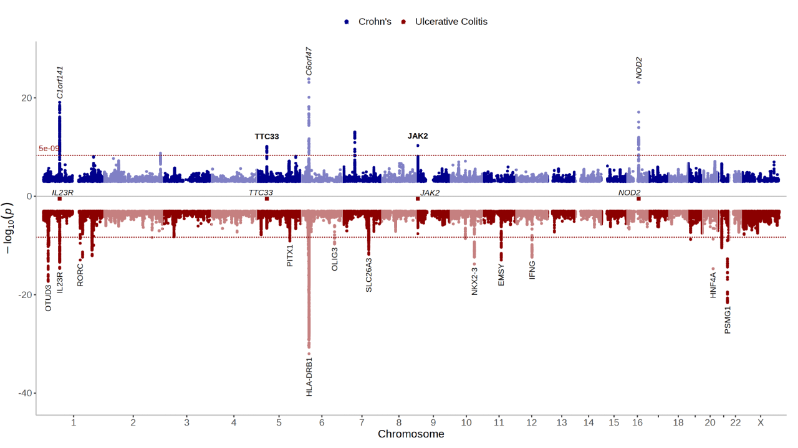

# topr : an R package for viewing and annotating genetic association data




## Installation
<hr>

Install from CRAN:

``` r
install.packages("topr")
```

Or from github:

``` r
devtools::install_github("GenuityScience/topr")
```

And then load the package:

``` r
library(topr)
```


## Main features and functionality
<hr>

### Example input datasets 

See the <a href="https://genuityscience.github.io/topr/articles/input_datasets.html">Input datasets vignette</a> for more detailed information.

Input datasets must include least three columns (<code>CHROM,
POS</code> and <code>P</code>), where naming of the columns is flexible
(i.e the chr label can be either chr or chrom and is case insensitive).

topr has 3 in-built datasets (GWASes), take a look at one of them by issuing the following command:

``` r
head(CD_UKBB)
```

The chromosome in the <code>CHROM</code> column can be represented with
our without the <i>chr</i> suffix, e.g (chr1 or 1)


### Basic usage 
<hr>

topr's two main plotting functions are <code>manhattan()</code> and <code>regionplot()</code>


#### Manhattan
<hr>

See the <a href="https://genuityscience.github.io/topr/articles/manhattan.html">Manhattan vignette</a> for more detailed examples of how to use the manhattan plot function

View the whole genome association results on a Manhattan plot:

``` r
manhattan(CD_UKBB)
```

Annotate the lead/index variants (with p-values below 5e-09) with their nearest gene:

``` r
manhattan(CD_UKBB, annotate=5e-09)
```

Display genes of interest at the bottom of the Manhattan plot to get a visual representation of their position relative to association peaks:

``` r
manhattan(CD_UKBB, annotate=5e-09, highlight_genes=c("IL23R","NOD2","NOTCH4","JAK"))
```

View one chromosome only:
``` r
manhattan(CD_UKBB, annotate=5e-09, chr="chr1")
```

Create a Manhattan of multiple GWAS results (in a list) on the same plot

``` r
manhattan(list(UC_UKBB, CD_UKBB), legend_labels=c("UC UKBB", "CD UKBB"))
```

Use the <code>ntop</code> argument to control how many GWASes are displayed at the top and bottom of the plot:

``` r
manhattan(list(UC_UKBB, CD_UKBB,CD_FINNGEN), legend_labels=c("UC UKBB", "CD UKBB","CD FINNGEN"), ntop=1)
```

<br>

#### Regionplot
<hr>
See the <a href="https://genuityscience.github.io/topr/articles/regionplot.html">Regionplot vignette</a> for more detailed examples of how to use the regionplot function.

Further zoom-in on a genetic region by gene name:

``` r
regionplot(CD_UKBB, gene="IL23R")
```

Label the top variant with it´s ID (rsid):

``` r
regionplot(CD_UKBB, gene="IL23R", annotate=5e-09)
```

Denser labelling of top variants (every 100000 kb) with vlines to get a better visual of where the variants are in relation to the genes and exons shown below:

``` r
regionplot(CD_UKBB, gene="IL23R", annotate_with_vline=5e-09, region_size=100000)
```
View the correlation pattern between the variants within the region in a locuszoom like plot.
Note that the variant correlation (R2) has to be pre-calculated and included in the input dataframe.

``` r
locuszoom(R2_CD_UKBB, gene="IL23R")
```

A region plot of multiple GWASes zoomed in on the IL23R gene

``` r
regionplot(list(UC_UKBB, CD_UKBB))
```

<br>

#### Useful functions
<hr>

Extract lead/index variants from the GWAS dataset (<code>CD_UKBB</code>):

```{r}
get_best_snp_per_MB(CD_UKBB)
```

Annotate the lead/index variants with their nearest gene:

```{r}
get_best_snp_per_MB(CD_UKBB) %>%  annotate_with_nearest_gene()
```

Get genomic coordinates for a gene:

```{r}
get_gene(gene_name="IL23R")
```

Get snps within a region:

```{r}
get_snps_within_region(CD_UKBB, region = "chr1:67138906-67259979")
```

Get the top variant on a chromosome:
```{r}
get_top_snp(CD_UKBB, chr="chr1")
```

<br>

#### Get help:

``` r
?manhattan()
?regionplot()
?locuszoom()
```
