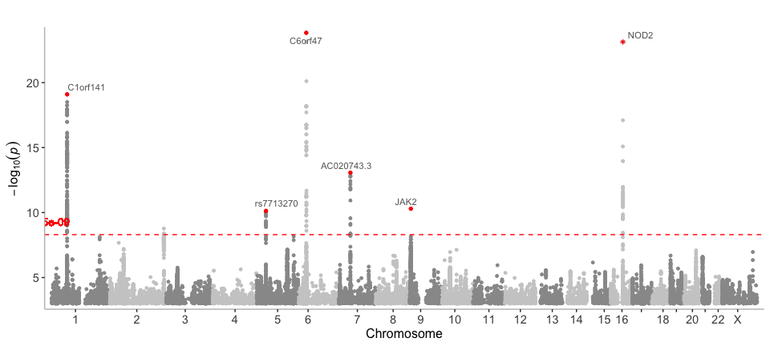
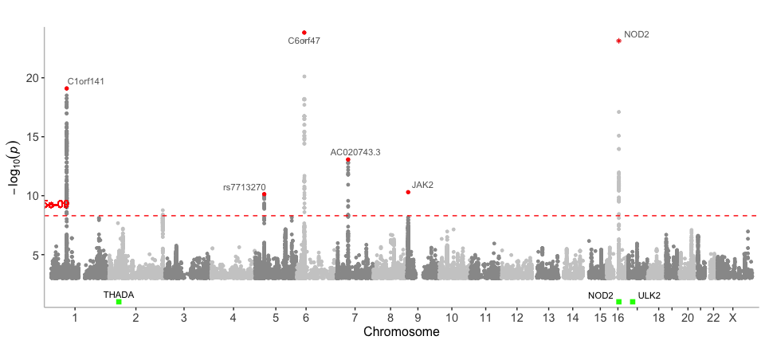
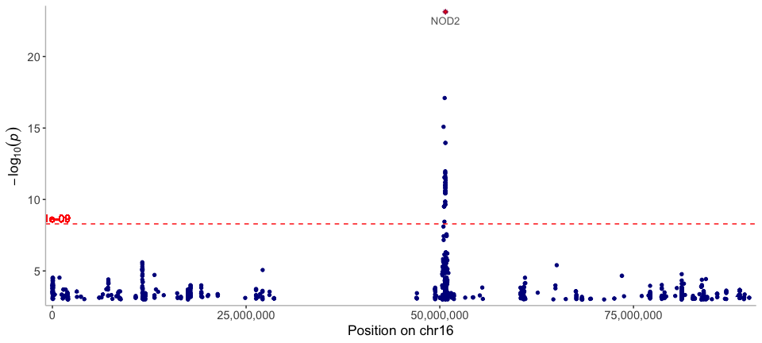
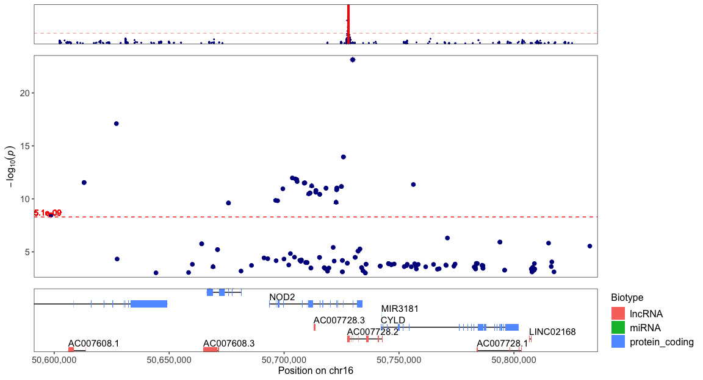
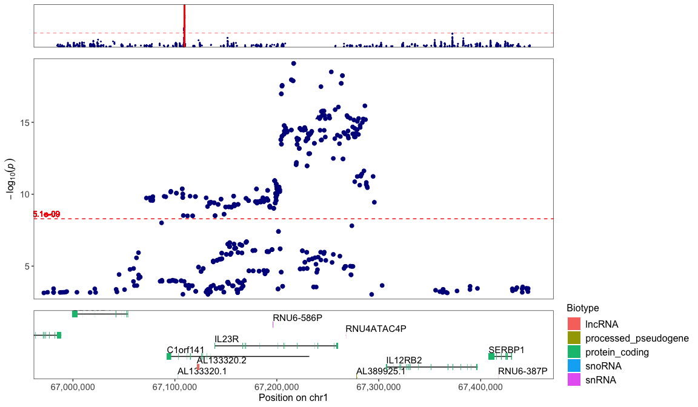
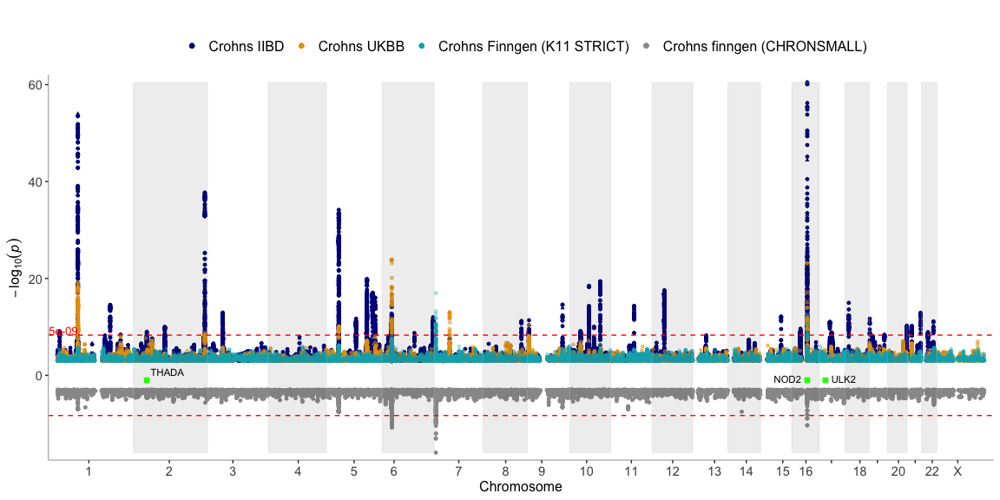

<!-- README.md is generated from README.Rmd. Please edit that file -->

# topR

See full documentation at <https://wuxi-nextcode.github.io/topR/>

### Installing from github using `devtools`

``` r
#devtools::install_github("wuxi-nextcode/topR")
```

## Example

In this example we demonstrate the basic usage of the topR library.

### Load packages

First load the `topr` package, the `tidyverse` package is recommended in
general, but not required for this example

``` r
library(topR)
library(tidyverse)
#> ── Attaching packages ─────────────────────────────────────── tidyverse 1.3.0 ──
#> ✔ ggplot2 3.3.3     ✔ purrr   0.3.4
#> ✔ tibble  3.1.2     ✔ dplyr   1.0.6
#> ✔ tidyr   1.1.3     ✔ stringr 1.4.0
#> ✔ readr   1.4.0     ✔ forcats 0.5.0
#> ── Conflicts ────────────────────────────────────────── tidyverse_conflicts() ──
#> ✖ dplyr::filter() masks stats::filter()
#> ✖ dplyr::lag()    masks stats::lag()
```

``` r
library(ggrepel)
```

### Loading and exploring prebuilt datasets

Load the `gwas_CD` dataset, which is a subset of association results
(SNPs with P&lt;1e-03) for Crohn´s disease from the UK biobank.

It is highly recommended to theck the number of datapoints in your
dataset before you plot, since a very large dataset will take a long
time to plot.

``` r
data(gwas_CD)
head(gwas_CD)
#>   CHROM     POS          ID       REF ALT        SE           P       OR
#> 1  chr1 1006415 rs145588482 TGGCAGCTC   T 0.1540620 0.000468758 0.583384
#> 2  chr1 1006415 rs145588482 TGGCAGCTC   T 0.1540620 0.000468758 0.583384
#> 3  chr1 1007256  rs76233940         G   A 0.1540250 0.000401567 0.579783
#> 4  chr1 1007256  rs76233940         G   A 0.1540250 0.000401567 0.579783
#> 5  chr1 1007256  rs76233940         G   A 0.1540250 0.000401567 0.579783
#> 6  chr1 1341559 rs376494450         C   T 0.0732974 0.000151216 1.320130
#>          AF Gene_Symbol Max_Impact         max_consequence
#> 1 0.0129317  AL645608.3     LOWEST downstream_gene_variant
#> 2 0.0129317       ISG15        LOW          intron_variant
#> 3 0.0130091  AL645608.1     LOWEST downstream_gene_variant
#> 4 0.0130091  AL645608.3     LOWEST downstream_gene_variant
#> 5 0.0130091       ISG15        LOW          intron_variant
#> 6 0.0270627        DVL1        LOW          intron_variant
```

``` r
paste("Number of SNPs in the dataset: [", length(gwas_CD$POS),"]", sep = "")
#> [1] "Number of SNPs in the dataset: [26821]"
```

### Manhattan plots

Get an overview of association results for crohn’s disease (CD) in a
Manhattan plot

``` r
manhattan(gwas_CD)
```


### Label the top SNPs with the name of the nearest gene

Use the `get_best_snp_per_MB` function to extract the top/lead SNPs from
the crohns dataset. Then include them in the manhattan call function
with the variants argument.

``` r
snps_CD <- get_best_snp_per_MB(gwas_CD, thresh = 1e-09, region = 10000000)
manhattan(gwas_CD, variants=snps_CD, annotation_thresh = 1e-09)
```

 \#\#
Label the position of genes of interest

``` r
genes=get_genes_by_Gene_Symbol(c("NOD2","ULK2","THADA"))
snps_CD <- get_best_snp_per_MB(gwas_CD, thresh = 1e-09, region = 10000000)
manhattan(gwas_CD, variants=snps_CD, annotation_thresh = 1e-09, highlight_genes=genes,highlight_genes_ypos = 1)
```



### Chromplot

Take a closer look at the results by chromosome. Here we plot the
results on chromosome 16 only.

``` r
CHR="chr16"
chromplot(gwas_CD,chr=CHR, variants = snps_CD, annotation_thresh = 5e-09)
```



### Regionplot

Zoom in further on the chromosome plot with the `regionplot` function.

Zoom in on a gene of interest:

``` r
regionplot(gwas_CD, gene="NOD2")
#> [1] "Zoomed to region: chr16:50593587-50834041"
```



Zoom in on the top hit on a chromosome

``` r
CHR="chr1"
top_hit=get_top_hit(gwas_CD,chr=CHR)
xmin=top_hit$POS-250000
xmax=top_hit$POS+250000
regionplot(gwas_CD, chr = CHR, xmin=xmin,xmax=xmax,show_exons = T)
#> [1] "Zoomed to region: chr1:66966513-67466513"
```



### Display multiple datasets on the same plot

Display the output from more than one GWAS on the same plot

### Chromplot - multiple phenotypes

Take a closer look at the results by chromosome. Here we plot the
results on chromosome 16 only.

``` r
CHR="chr16"
snps_CD_IIBD <- get_best_snp_per_MB(gwas_CD_IIBD, thresh = 1e-09, region = 10000000)
chromplot(list(gwas_CD_IIBD,gwas_CD),chr=CHR, variants = list(snps_CD_IIBD,snps_CD),
          annotation_thresh = 5e-09, legend_labels=c("Crohns IIBD", "Crohns UKBB"), alpha=c(1,0.7),size=c(1.2,1))
```


### Manhattan - multiple phenotypes

``` r
data(gwas_CD_IIBD)
manhattan(list(gwas_CD_IIBD,gwas_CD), legend_labels=  c("Crohns IIBD", "Crohns UKBB"), alpha = c(1, 0.5))
```


``` r
data(finngen_K11_CD_STRICT)
data(finngen_CHRONSMALL)
genes=get_genes_by_Gene_Symbol(c("NOD2","ULK2","THADA"))
manhattan(list(gwas_CD_IIBD,gwas_CD,finngen_K11_CD_STRICT,finngen_CHRONSMALL),
          ntop=3,
          legend_labels=  c("Crohns IIBD", "Crohns UKBB","Crohns Finngen (K11 STRICT)", "Crohns finngen (CHRONSMALL)"),
          alpha = c(1,0.5,0.3,1),
          highlight_genes = genes,
          highlight_genes_ypos = -1)
```


