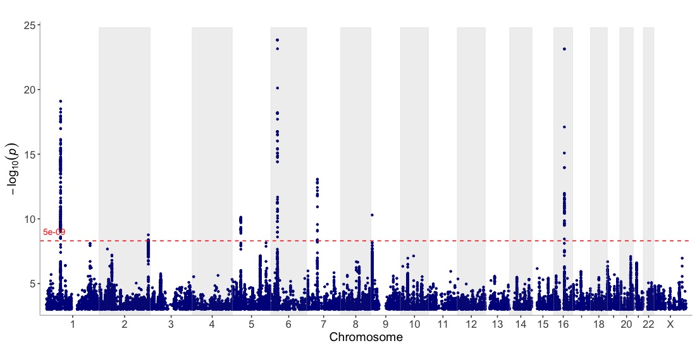
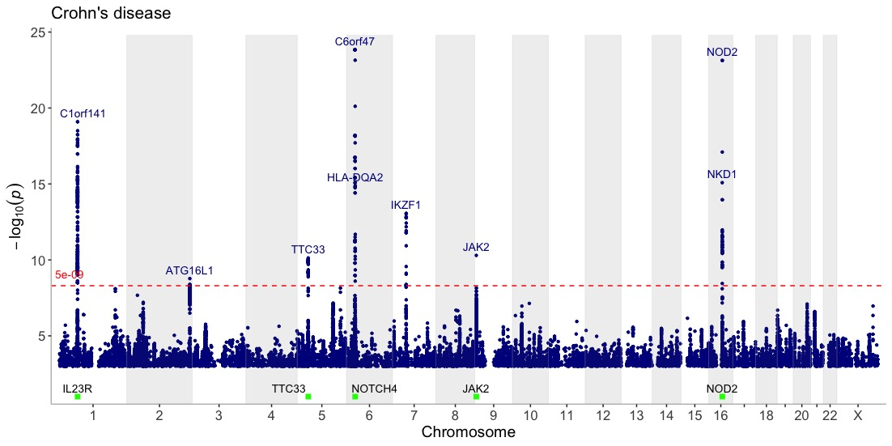
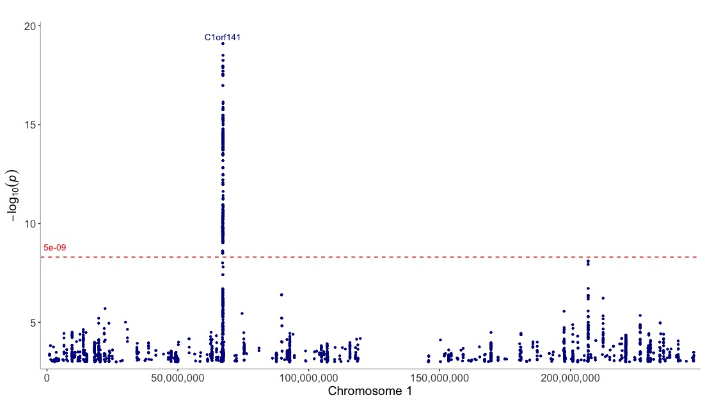
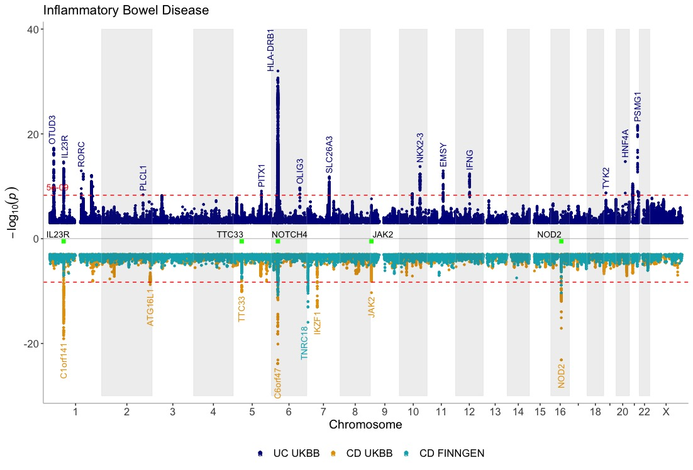

<!--
%\VignetteEngine{knitr::knitr}
%\VignetteIndexEntry{Intro into manhattan}
-->

```{r, include=FALSE}
    library(topr)
    library(dplyr)
```
<hr>

## manhattan


Displays GWAS results over the entire genome.

Get an overview of the in-built Crohn's GWAS results (<code>CD_UKBB</code>):
```{r, eval=FALSE}
manhattan(CD_UKBB)
```
```{r echo=FALSE, out.width='100%'}

```


Annotate the lead/index variants (with p-values below 5e-09) with their nearest gene and add a title:
```{r, eval=FALSE}
manhattan(CD_UKBB, annotate=5e-09,  title="Crohn's disease")
```
```{r echo=FALSE, out.width='100%'}
knitr::include_graphics('figures/manhattan_annotate.jpg')
```


Display genes of interest at the bottom of the Manhattan plot to get a visual representation of their position relative to association peaks:
```{r, eval=FALSE}
genes=c("IL23R","NOTCH4","NOD2","JAK2","TTC33")
manhattan(CD_UKBB, annotate=5e-09, title="Crohn's disease", highlight_genes = genes)
```
```{r echo=FALSE, out.width='100%'}

```


View one chromosome only:
```{r, eval=FALSE}
manhattan(CD_UKBB, annotate=5e-09, chr="chr1")
```
```{r echo=FALSE, out.width='100%'}

```


Create a Manhattan of multiple GWAS results (in a list) on the same plot

```{r eval=FALSE}
manhattan(list(UC_UKBB, CD_UKBB), legend_labels=c("UC UKBB", "CD UKBB"))
```
```{r echo=FALSE, out.width='100%'}
knitr::include_graphics('figures/manhattan_multi.jpg')
```

Show three GWASes on the same plot, using different annotation thresholds for each dataset. Also, add genes of interest to the plot
Use the ntop argument to control how many GWASes are displayed at the top and bottom of the plot:
```{r, eval=FALSE}
dat <- list(UC_UKBB,CD_UKBB,CD_FINNGEN)
manhattan(dat, legend_labels=c("UC UKBB", "CD UKBB","CD FINNGEN"), annotate=c(5e-9,5e-9,1e-15), region_size=100000000, ntop=1, highlight_genes = genes, highlight_genes_ypos = -0.5 , angle=90, ymax=40, ymin=-30, nudge_y = 2, title="Inflammatory Bowel Disease")
```
```{r echo=FALSE, out.width='100%'}

```
