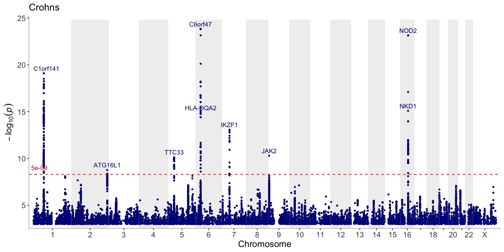
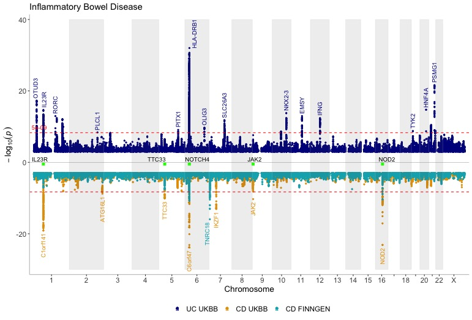
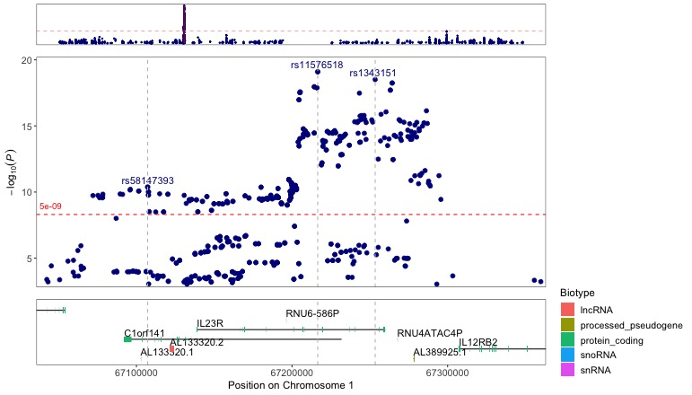
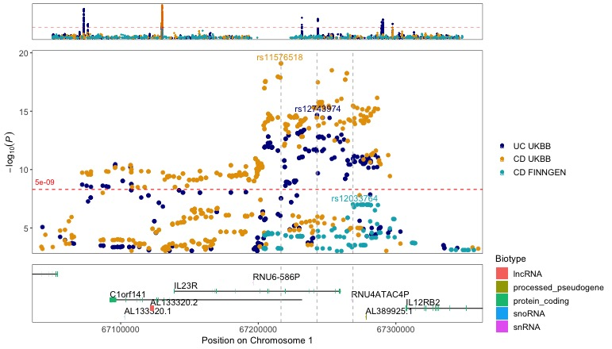
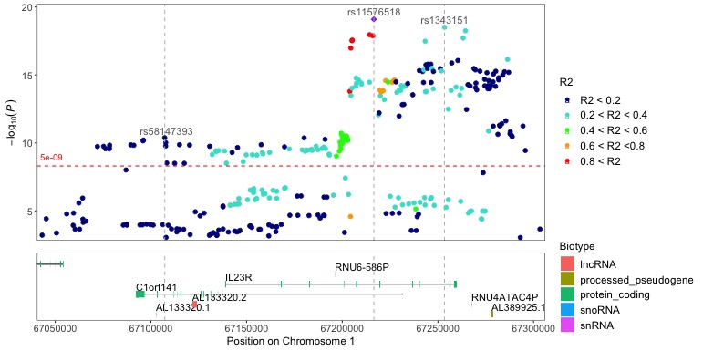

<!--
%\VignetteEngine{knitr::knitr}
%\VignetteIndexEntry{Intro to the topr package}
-->

```{r, include=FALSE}
    library(topr)
    library(dplyr)
```
<hr>
<--

-->

Main features and functionalities of the topr packages are shown below.

See the function specific vignettes for more detailed examples for the <code>manhattan</code> and <code>regionplot</code> functions.

## Example input datasets


topr comes with three example GWAS datasets, one on Ulcerative Colitis retrieved from the UKBB (<code>UC_UKBB</code>), and the other two on Crohn’s disease (<code>CD_UKBB</code> and <code>CD_FINNGEN</code>) obtained from the FinnGen and UK biobanks respectively. topr utilizes gene and exon datasets from Ensembl (GRCh38.pxx) (<code>ENSGENES</code> and <code>ENSEXONS</code>).
<!--
See <a href="https://wuxi-nextcode.github.io/topr/reference/index.html">topr reference</a> for more details on the in-built datasets.
-->
Input datasets must include least three columns (<code>CHROM,
POS</code> and <code>P</code>), where naming of the columns is flexible
(i.e the chr label can be either chr or chrom and is case insensitive).

Take a look at the in-built Crohn's GWAS (<code>CD_UKBB</code>) by issuing the following command:

```{r}
CD_UKBB %>% head(n=6)
```


The chromosome in the <code>CHROM</code> column can be represented with
or without the <i>chr</i> suffix, e.g (chr1 or 1)
<hr>

## Usage

topr´s two main plotting functions,<code> manhattan()</code> and <code>regionplot()</code>, display GWAS results over the entire genome and for smaller genetic regions along with gene and exon information.

### Manhattan plots

Get an overview of the Crohn's GWAS results on a Manhattan plot, and annotate association peaks with their nearest gene:


```{r, eval=FALSE}
manhattan(CD_UKBB, annotate=5e-09,  title="Crohn's disease")
```
```{r echo=FALSE, out.width='100%'}

```

Show three GWASes on the same plot, using different annotation thresholds for each dataset. Also, add genes of interest to the plot

```{r, eval=FALSE}
dat <- list(UC_UKBB,CD_UKBB,CD_FINNGEN)
genes=c("IL23R","NOTCH4","NOD2","JAK2","TTC33")
manhattan(dat, legend_labels=c("UC UKBB", "CD UKBB","CD FINNGEN"), annotate=c(5e-9,5e-9,1e-15), region_size=100000000, ntop=1, highlight_genes = genes, highlight_genes_ypos = -0.5 , angle=90, ymax=40, ymin=-30, nudge_y = 2, title="Inflammatory Bowel Disease")
```
```{r echo=FALSE, out.width='100%'}

```
<!--
See the <a href="https://cran.r-project.org/web/packages/topr/vignettes/manhattan.html"> Manhattan plot vignette</a> for more detailed examples on the <code>manhattan</code> function
-->

### Region plots

Zoom-in on the region around the IL23R gene.

Annotate the top variant within each 100kb window and draw a vertical line through their positions to further highlight their position in relation to the genes and exons below.

```{r regionplot_annotate, eval=FALSE}
regionplot(CD_UKBB, gene="IL23R", annotate_with_vline = 5e-09, region_size = 100000)
```

```{r echo=FALSE, out.width='100%'}

```

Zoom in on the IL23R gene for multiple GWASes

```{r regionplot_multi, eval=FALSE}
regionplot(list(UC_UKBB,CD_UKBB,CD_FINNGEN), gene="IL23R", annotate_with_vline = 5e-06, legend_labels=c("UC UKBB","CD UKBB","CD FINNGEN"))
```
```{r echo=FALSE, out.width='100%'}

```


#### Locuszoom-like plots

Locuszoom-like plot. Note that the input dataframe needs to include the R2 column with the pre-calculated r2 values, since topr does not do these calculations.

Annotate the variants with vertical lines highlighting their positions on the plot:

```{r locuszoom_annotate, eval=FALSE}
locuszoom(R2_CD_UKBB, annotate_with_vline = 1e-09, region_size = 100000)
```
```{r echo=FALSE, out.width='100%'}

```
<!--
See the <a href="https://cran.r-project.org/web/packages/topr/vignettes/regionplot.html"> Regionplot plot vignette</a> for more detailed examples on the <code>regionplot</code> function

-->
